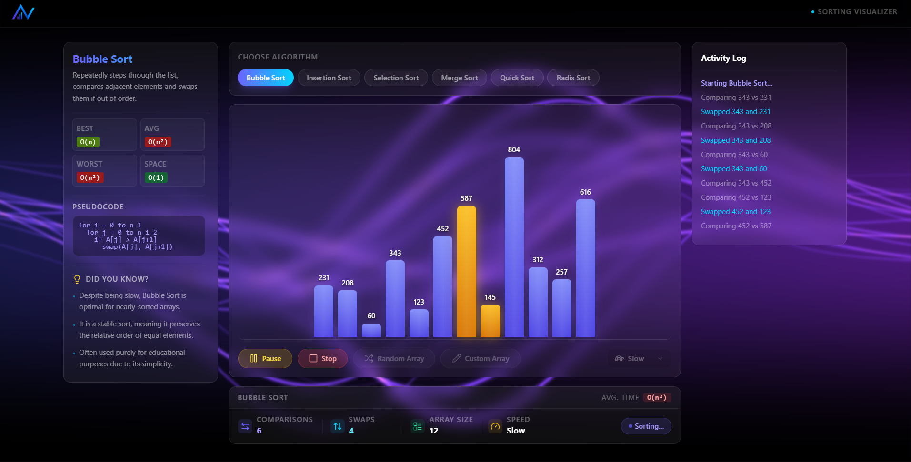

<div align="center">

# ⚡ AlgoVision

### Interactive Sorting Algorithm Visualizer with Real-Time Analytics

*Watch algorithms think. Understand them intuitively.*



[](https://reactjs.org/)
[](https://vitejs.dev/)
[](https://www.typescriptlang.org/)
[](https://tailwindcss.com/)
[](LICENSE)

<!-- Add your own deployed URL here -->

</div>

---

## ✨ Features

AlgoVision is a **premium dark-themed dashboard** built for exploring, visualizing, and understanding sorting algorithms in real time. Every feature below is fully implemented.

### 🧮 Algorithms
| Algorithm | Type | In-Place |
|---|---|---|
| Bubble Sort | Comparison | ✅ |
| Insertion Sort | Comparison | ✅ |
| Selection Sort | Comparison | ✅ |
| Merge Sort | Divide & Conquer | ❌ |
| Quick Sort | Divide & Conquer | ✅ |
| Radix Sort | Non-Comparative | ❌ |

### 📊 Live Analytics Dashboard
- **Real-time comparison counter** — tracks every element comparison as it happens
- **Real-time swap / write counter** — distinct tracking per algorithm (swaps vs. writes)
- **Array size display** — always visible in the stats bar
- **Speed indicator** — synced live with the current playback speed

### 🎮 Controls
- **Start** — begin the visualization from scratch
- **Pause / Resume** — freeze and continue mid-sort without losing state
- **Stop** — abort sorting at any moment and reset
- **Random Array** — generate a new shuffled array instantly
- **Custom Array** — enter your own comma-separated values (up to 14 elements, values 1–1000)
- **Speed selector** — three presets: Slow · Normal · Fast

### 📋 Algorithm Info Panel (Left Sidebar)
- Full **complexity grid** — Best, Average, Worst (time) and Space complexity with color-coded badges
- **Pseudocode viewer** — clean monospace code block per algorithm
- **"Did You Know?" tips** — 3 curated educational facts per algorithm

### 📜 Activity Log (Right Sidebar)
- **Auto-scrolling live feed** of every comparison and swap in plain English
- Color-coded entries: comparisons in muted white, swaps in cyan `#00d4ff`, algorithm actions in purple

### 🎨 Visual & UX
- **Animated WebGL shader background** — dynamic purple wave mesh (via `@paper-design/shaders`)
- **Glassmorphism UI** — frosted-glass cards throughout the dashboard
- **Sorted status badge** — animated state indicator (Unsorted → Sorting… → Paused → Sorted ✓)
- **Bar labels** — numeric values displayed above bars when array size ≤ 20 elements
- **Premium dark theme** — deep navy-black canvas with violet/cyan accent palette
- **Responsive 3-column layout** — collapses gracefully from `xl` three-column to stacked on smaller screens

---

## 🖥️ How It Works

AlgoVision steps through each algorithm one operation at a time. Each bar represents an element in the array, and its height corresponds to its value.

### Bar Color Coding

| Color | Meaning |
|---|---|
| 🔵 Blue (default) | Unsorted — element at rest |
| 🟡 Yellow / Orange | Currently being **compared** |
| 🔴 Red | Being **swapped** or **moved** |
| 🟢 Green | **Sorted** — element in its final position |

Sorting is driven by async generator functions that yield at each step, pausing execution between operations to produce the frame-by-frame animation. The delay between steps is controlled by the **Speed** selector (Slow: 1000ms · Normal: 500ms · Fast: 250ms).

---

## 📐 Complexity Reference

| Algorithm | Best | Average | Worst | Space |
|---|---|---|---|---|
| Bubble Sort | O(n) | O(n²) | O(n²) | O(1) |
| Insertion Sort | O(n) | O(n²) | O(n²) | O(1) |
| Selection Sort | O(n²) | O(n²) | O(n²) | O(1) |
| Merge Sort | O(n log n) | O(n log n) | O(n log n) | O(n) |
| Quick Sort | O(n log n) | O(n log n) | O(n²) | O(log n) |
| Radix Sort | O(nk) | O(nk) | O(nk) | O(n + k) |

> **n** = number of elements · **k** = number of digits (Radix Sort)

---

## 🛠️ Tech Stack

| Layer | Technology |
|---|---|
| UI Framework | React 18 |
| Build Tool | Vite 8 |
| Language | JavaScript (JSX) + TypeScript |
| Styling | Tailwind CSS 3 + custom CSS |
| Icons | Lucide React |
| Background | `@paper-design/shaders` (WebGL) |
| UI Utilities | `clsx`, `tailwind-merge`, `class-variance-authority` |
| Component Primitives | `@radix-ui/react-slot` |

---

## 🚀 Installation

**Prerequisites:** Node.js 16+

```bash
# 1. Clone the repository
git clone https://github.com/arjunsomesh5432-cloud/AlgoVision.git

# 2. Navigate into the project
cd AlgoVision

# 3. Install dependencies
npm install

# 4. Start the development server
npm run dev
```

The app will be available at **`http://localhost:5173`**

---

## 🗂️ Project Structure

```
AlgoVision/
├── public/
│   └── logo.png                  # App logo
├── src/
│   ├── components/
│   │   ├── ActivityLog.jsx       # Right sidebar — live event feed
│   │   ├── AlgoInfo.jsx          # Left sidebar — complexity, pseudocode, tips
│   │   ├── SortingChart.jsx      # Center — bar chart, controls, stats bar
│   │   └── ui/
│   │       ├── PremiumSelect.tsx         # Custom speed dropdown
│   │       ├── shader-background.tsx     # Animated WebGL background
│   │       ├── liquid-glass-button.tsx   # Glassmorphic button variant
│   │       └── liquid-metal-button.tsx   # Metallic button variant
│   ├── contexts/
│   │   └── SortingContext.jsx    # Global state — sorting engine + activity log
│   ├── data/
│   │   └── algorithmInfos.js     # Algorithm metadata (complexity, descriptions)
│   ├── helpers/
│   │   ├── math.js               # Array generation utilities
│   │   └── promises.js           # Async delay helpers
│   ├── App.jsx                   # Root layout — navbar + 3-column dashboard
│   ├── index.css                 # Global styles, glassmorphism, bar animations
│   └── main.jsx                  # React entry point
├── index.html
├── vite.config.js
├── tailwind.config.js
└── package.json
```

---

## 🔮 Future Improvements

- [ ] **Sorting Race Mode** — run two algorithms side-by-side and compare performance live
- [ ] **More Algorithms** — Heap Sort, Shell Sort, Tim Sort, Counting Sort
- [ ] **Theme Switching** — toggle between dark, light, and high-contrast themes
- [ ] **Export / Share** — generate a shareable link with a pre-loaded array and algorithm
- [ ] **Sound Effects** — audio pitch mapped to bar height for an immersive experience
- [ ] **Step-through Mode** — manual next/prev stepping for deep learning

---

## 📄 License

This project is licensed under the **MIT License** — see the [LICENSE](LICENSE) file for details.

---

<div align="center">

Made with ❤️ and a deep interest in algorithms

</div>
